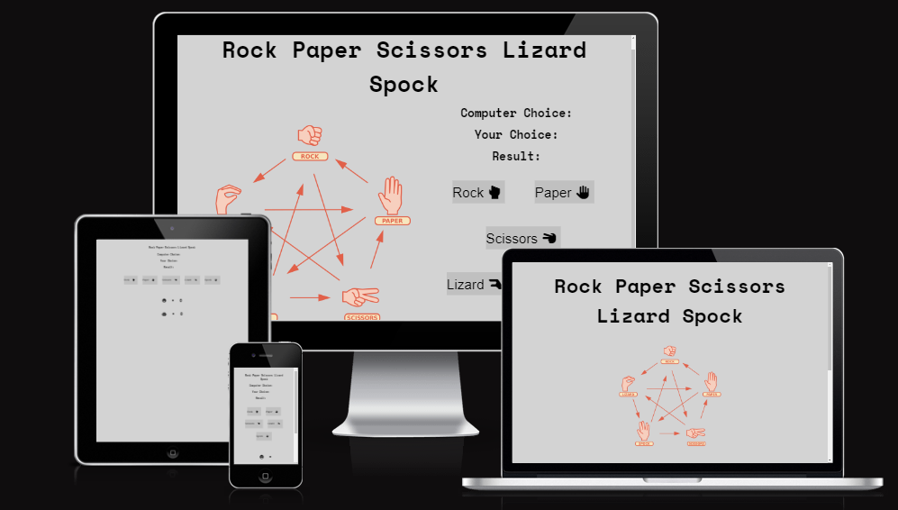
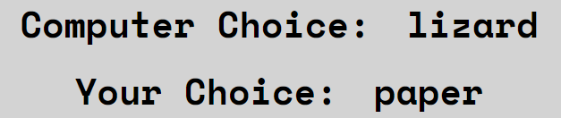
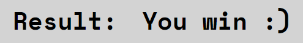
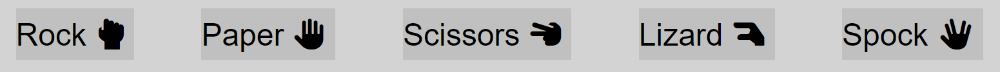
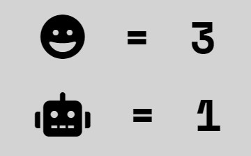
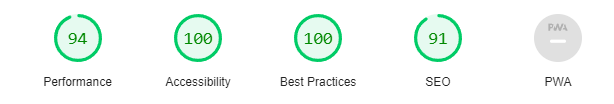
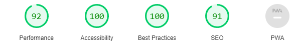

# Rock Paper Scissors Lizard Spock

## Rock Paper Scissors Lizard Spock. Is website where you can play a lovely game of advanced rock, paper, scissors agains the computer, and hopefully win!

### The live website can be found here; [Rock,Paper,Scissors,Lizard,Spock]( https://mattheuskasa.github.io/Rock-Paper-Scissors-Lizard-Spock//)

&nbsp;

## Table of Contents
1. ## [**Features**](#features-1)
    - [**Header**](#header)
    - [**Explanation of the game**](#explanation-of-the-game)
    - [**Choices**](#choices)
    - [**Results**](#result)
    - [**Options**](#options)
    - [**Scoreboard**](#scoreboard)

2. ## [**Testing**](#testing-1)
    - [**Validators**](#validators)
    - [**Accessibility**](#accessibility)

3. ## [**Bugs and Errors**](#bugs-and-errors-1)
    - [**Solved**](#solved)
    - [**Unsolved**](#unsolved)

4. ## [**Compatability**](#compatibility)

5. ## [**Deployment**](#deployment)

6. ## [**Credits**](#credits)

# Mockup

---

&nbsp;

# Features

## Header
- ### The Header - The name of the game, quick and easy to instantly understand whats to come.

## Explanation of the game
- ### An image explaining how to play the game.

## Choices
- ### Computer/User choices - Shows choice of both the computer and the user.

## Result
- ### The Result - Lets you know if it was a draw, you lost, or you won!

## Options
- ### Options - Lets you choose between the five different options, theres also an image next to each text.

## Scoreboard
- ### Scoreboard - Allows you to keep track of how many rounds you and the computer have each won.

---

&nbsp;

# Testing

- ## Validators

- ### HTML
  - ### No errors were found when passing through the official [W3C HTML validator.](https://validator.w3.org/)

- ### CSS
  - ### No errors were found when passing through the official [W3C CSS validator.](https://jigsaw.w3.org/css-validator/#validate_by_uri)

- ### JavaScript
  - ### No errors were found when passing the code through [Jshint.](https://jshint.com/)

&nbsp;

- ## Accessibility

  - ### I confirmed that the colours have enough contrast and fonts chosen are easy to read, and all links, icons and images have descriptive text for screen readers running it through Lighthouse in Chrome DevTools.
  - ### Tested the website in Chrome and Samsung internet browser for both mobile and desktop.
  - ### Tested and confirmed that the website is responsive on all screen sizes using dev tools.

### Desktop

  

### Mobile

  

  # Bugs and Errors

  - ## Solved

  - ### When adapting the site for mobile i found it to be a better experience to remove to image completely.

  - ## Unsolved

  - ### No unsolved bugs.

---

# Deployment

 ## The site was deployed to GitHub Pages with the following steps:
  - ## Click on the **Settings** tab in the Github repository for the project.
  - ## Click on the **Pages** section of the menu on the left.
  - ## Under **Source**, select **Branch:Main**, and click **Save**.
  - ## The site should now be deployed succesfully and after a few minutes the link can be clicked and lead you to the website.

## The live website can be found here: [Rock,Paper,Scissors,Lizard,Spock]( https://mattheuskasa.github.io/Rock-Paper-Scissors-Lizard-Spock//)

&nbsp;

 # Credits

 - ## Support of documentation in [W3schools.](https://www.w3schools.com/)
 - ## Icons from [Font Awesome.](https://fontawesome.com/)
 - ## Images created and resized using [Microsoft Paint.](https://sv.wikipedia.org/wiki/Microsoft_Paint)
 - ## Images found at [Pexels](https://www.pexels.com/)